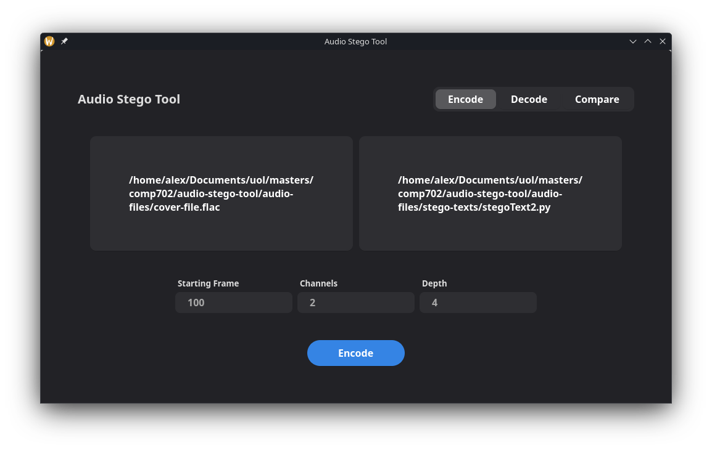

# Audio Stego Tool

### An application allowing for stego text to be embedded into cover audio files.
Currently provides a command line and graphical user interface, and primarily working with lossless files

## Graphical User Interface (GUI)
The GUI is a desktop application made using GTK 4, compatible with Windows, macOS, and Linux systems. The GUI aims to provide the functionality of the [CLI](#command-line-interface-cli) through a graphical interface.

Note: The GUI currently has all the functionality of the CLI.


Initiate with:
```
project root$ python -m gui.main
```

## Command Line Interface (CLI)

Use with command:
```
project root$ python -m stego.main [args]
```

### CLI
```
usage: stego.main {encode, decode, compare}

positional arguments:
  {encode,decode,compare}
    encode              Embed a message into an audio file
    decode              Extract a message from an audio file
    compare             Compare audio files with eachother
```

### Encode
```
usage: main.py encode [--readFile] [--startFrame] [--channels] [--depth]
                      filePath stegoText outputPath

positional arguments:
  filePath
  stegoText
  outputPath

options:
  --readFile, -rf
      Read message from a text file. (default: N)
  --startFrame, -sf
      The frame the encoder will start embedding from. (default: 0)
  --channels, -ch
      The number of channels that will be used when embedding the message. (default: 1)
  --depth, -d
      The number of LSBs to modify for a given frame. (default: 1)
```

### Decode
```
usage: stego.main decode [--startFrame] [--channels] [--output] [--depth]
                         filePath messageLength

positional arguments:
  filePath
  messageLength

options:
  --startFrame, -sf
      The frame the decoder will start extracting from (default: 0)
  --channels, -ch
      The number of channels that will be used when extracting the message. (default: 1)
  --output, -o
      Output the extracted text into a file.
  --depth, -d
      The number of LSBs to extract for a given frame. (default: 1)
```

### Compare
```
usage: stego.main compare [--startFrame] [--channels] [--depth]
                          audioPath1 audioPath2 messageLength

positional arguments:
  audioPath1
  audioPath2
  messageLength

options:
  --startFrame, -sf
    The frame the comparison will start from (default: 0)
  --channels, -ch
    The number of channels that will be compared. (default: 1)
  --depth, -d
      The number of LSBs to check for a given frame. (default: 1)
```
